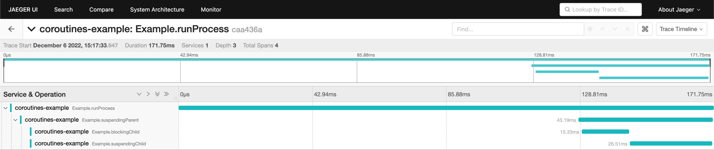
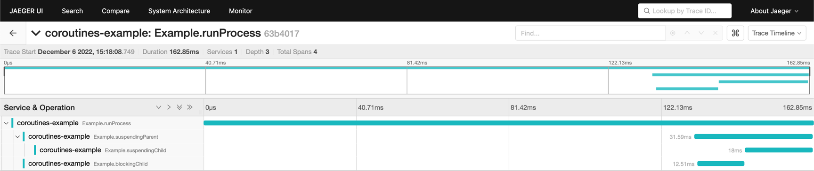

# open-telemetry-coroutine-tracing-repro

## Setup

This project uses [Hermit](https://cashapp.github.io/hermit/) to ensure consistent versions of tools are used, however,
it should still work with local JDK/Gradle installations.

## Running

### Jaeger

```shell
docker run -d --name jaeger \  -e COLLECTOR_ZIPKIN_HOST_PORT=:9411 \                              
  -e COLLECTOR_OTLP_ENABLED=true \
  -p 6831:6831/udp \
  -p 6832:6832/udp \
  -p 5778:5778 \
  -p 16686:16686 \
  -p 4317:4317 \
  -p 4318:4318 \
  -p 14250:14250 \
  -p 14268:14268 \
  -p 14269:14269 \
  -p 9411:9411 \
  jaegertracing/all-in-one:1.38
```

Note, this run command was taken from the [Jaeger Docs](https://www.jaegertracing.io/docs/1.6/getting-started/#all-in-one-docker-image)
and probably opens unnecessary ports for this example.

Once running, you can view the UI at http://localhost:16686/. 

### Application

```shell
gradle run
```

You may want to compare the difference with the `otel.instrumentation.kotlinx-coroutines.enabled` flag enabled or 
disabled. You can toggle this by commenting out or including [this line in the gradle build file](./build.gradle.kts#L38).

## Expected Result

Given the chain of call in [Example.kt](./src/main/kotlin/example/Example.kt) I would expect to see the 
`Example.blockingChild` span nested under `Example.suspendingParent` like so:



This trace is what is produced when it does when `otel.instrumentation.kotlinx-coroutines.enabled` is set to `false`.

## Actual Result

When `otel.instrumentation.kotlinx-coroutines.enabled` is set to `true`, what we actually get is `Example.blockingChild`
nesting under `Example.runProcess` (the root span):


